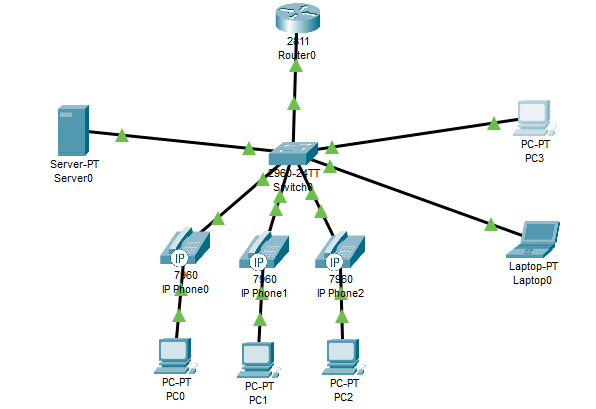

# Mini Projeto - Servidor e Voip



## Topologia

- 1 Roteador 2811
- 1 Switch (qualquer modelo)
- 1 Servidor
- 4 PCs e 1 Notebook
- 3 IP Phones

--- 

## SWITCH

### Passo 1: Ativar a porta trunk

No switch, acesse a interface que está conectada ao roteador:

```bash
Switch(config)#int g0/1
Switch(config-if)#switchport mode trunk
Switch(config-if)#switchport trunk allowed vlan all
```

> Estes comandos servem para definir uma porta TRUNK, isso permite que a porta em questão possa transportar o tráfego de várias Vlans simultaneamente.

### Passo 2: Criar 3 Vlans (VOIP, VENDAS E TI)

No switch:

```bash
Switch(config)#vlan 10
Switch(config-vlan)#name VOIP
Switch(config-vlan)#vlan 20
Switch(config-vlan)#name VENDAS
Switch(config-vlan)#vlan 30
Switch(config-vlan)#name TI
```

### Passo 3: Atribuir as interfaces as suas respectivas Vlans

No switch:

```bash
Switch(config)#int range fa0/1-3
Switch(config-if-range)#switchport mode access
Switch(config-if-range)#switchport access vlan 20
Switch(config-if-range)#switchport voice vlan 10
Switch(config-if-range)#exit
```
> Perceba que pras interfaces conectadas ao IP Phone devemos usar o comando "switchport voice..." para a Vlan que usaremos para Voice.

Continuando:

```bash
Switch(config)#int range fa0/4-5
Switch(config-if-range)#switchport mode access
Switch(config-if-range)#switchport access vlan 30
Switch(config-if-range)#exit
```

No final, a distribuição das interfaces ficará dessa forma:

```bash
VLAN Name                             Status    Ports
---- -------------------------------- --------- -------------------------------
1    default                          active    Fa0/6, Fa0/7, Fa0/8, Fa0/9
                                                Fa0/10, Fa0/11, Fa0/12, Fa0/13
                                                Fa0/14, Fa0/15, Fa0/16, Fa0/17
                                                Fa0/18, Fa0/19, Fa0/20, Fa0/21
                                                Fa0/22, Fa0/23, Fa0/24, Gig0/1
                                                Gig0/2
10   VOIP                             active    Fa0/1, Fa0/2, Fa0/3
20   VENDAS                           active    Fa0/1, Fa0/2, Fa0/3
30   TI                               active    Fa0/4, Fa0/5
1002 fddi-default                     active    
1003 token-ring-default               active    
1004 fddinet-default                  active    
1005 trnet-default                    active  
```
---

## ROTEADOR

### Passo 4: Acessar a interface que se conecta ao Switch

Nós criaremos subinterfaces, mas primeiro, devemos ligar a interface e não definir nenum IP a ela.

No router:

```bash
Router>en
Router#conf t
Router(config)#int fa0/0
Router(config-if)#no ip add
Router(config-if)#no shutdown
```

### Passo 5: Criar a subinterface para o Gateway Padrão

No router:

```bash
Router(config)#interface fa0/0.1
Router(config-subif)#
%LINK-5-CHANGED: Interface FastEthernet0/0.1, changed state to up

%LINEPROTO-5-UPDOWN: Line protocol on Interface FastEthernet0/0.1, changed state to up

Router(config-subif)#encapsulation dot1q 1 native
Router(config-subif)#ip address 192.168.0.1 255.255.255.0
Router(config-subif)#no shutdown
Router(config-subif)#exit
Router(config)#do wr
```

### Passo 6: Criar a subinterface para as 3 Vlans

No router:

```bash
Router(config)#interface fa0/0.10
Router(config-subif)#
%LINK-5-CHANGED: Interface FastEthernet0/0.10, changed state to up

%LINEPROTO-5-UPDOWN: Line protocol on Interface FastEthernet0/0.10, changed state to up

Router(config-subif)#encapsulation dot1q 10
Router(config-subif)#ip address 192.168.10.1 255.255.255.0
Router(config-subif)#ip helper-address 192.168.0.2
Router(config-subif)#no shutdown
Router(config-subif)#exit
Router(config)#interface fa0/0.20
Router(config-subif)#
%LINK-5-CHANGED: Interface FastEthernet0/0.20, changed state to up

%LINEPROTO-5-UPDOWN: Line protocol on Interface FastEthernet0/0.20, changed state to up

Router(config-subif)#
Router(config-subif)#ip address 192.168.20.1 255.255.255.0
Router(config-subif)#ip helper-address 192.168.0.2
Router(config-subif)#no shutdown
Router(config-subif)#exit
Router(config)#interface fa0/0.30
Router(config-subif)#
%LINK-5-CHANGED: Interface FastEthernet0/0.30, changed state to up

%LINEPROTO-5-UPDOWN: Line protocol on Interface FastEthernet0/0.30, changed state to up

Router(config-subif)#encapsulation dot1q 30
Router(config-subif)#ip address 192.168.30.1 255.255.255.0
Router(config-subif)#ip helper-address 192.168.0.2
Router(config-subif)#no shutdown
Router(config-subif)#exit
Router(config)#do wr
```
---

## SERVER

### Passo 7: Configurar o IP do roteador

Em *IP Configuration*:

**IP**: 192.168.0.2
**Máscara**: 255.255.255.0
**Default Gateway**: 192.168.0.1
**DNS Server**: 192.168.0.2

### Passo 8: Configurar os pools DHCP

Precisaremos de 3 pools, um para cada Vlan, eles devem ficar da seguinte forma:

#### VLAN VOIP

**Pool name**: VOIP
**Default Gateway**: 192.168.10.1
**DNS Server**: 192.168.0.2
**Startp IP Address**: 192.168.10.5
**TFTP Server**: 192.168.10.1

#### VLAN VENDAS

**Pool name**: VENDAS
**Default Gateway**: 192.168.20.1
**DNS Server**: 192.168.0.2
**Startp IP Address**: 192.168.20.5

#### VLAN TI

**Pool name**: TI
**Default Gateway**: 192.168.30.1
**DNS Server**: 192.168.0.2
**Startp IP Address**: 192.168.30.5

### Passo 9: Configurar um DNS

Vamos configurar um servidor DNS da seguinte forma:

**Name**: www.teste.br
**Address**: 192.168.0.2

---

## ROUTER

### Passo 10: Configurar os IP Phones

No roteador, faremos a configuração do serviço de telefonia:

```bash
Router(config)#telephony-service
Router(config-telephony)#max-ephones 3
Router(config-telephony)#max-dn 3
Router(config-telephony)#ip source-address 192.168.10.1 port 2000
Router(config-telephony)#auto assign 1 to 6
Router(config-telephony)# create cnf-files
Router(config-telephony)#exit
```

Agora, configuraremos o ramal de cada telefone:

```bash
Router(config)#ephone-dn 1
Router(config-ephone-dn)#%LINK-3-UPDOWN: Interface ephone_dsp DN 1.1, changed state to up

Router(config-ephone-dn)#number 1001
Router(config-ephone-dn)#exit
Router(config)#ephone-dn 2
Router(config-ephone-dn)#%LINK-3-UPDOWN: Interface ephone_dsp DN 2.1, changed state to up

Router(config-ephone-dn)#number 1002
Router(config-ephone-dn)#exit
Router(config)#ephone-dn 3
Router(config-ephone-dn)#%LINK-3-UPDOWN: Interface ephone_dsp DN 3.1, changed state to up

Router(config-ephone-dn)#number 1003
Router(config-ephone-dn)#exit
```

Depois, vá em cada IP Phone e arraste o adaptador de energia até eles.


